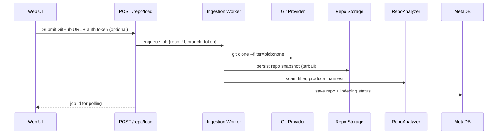
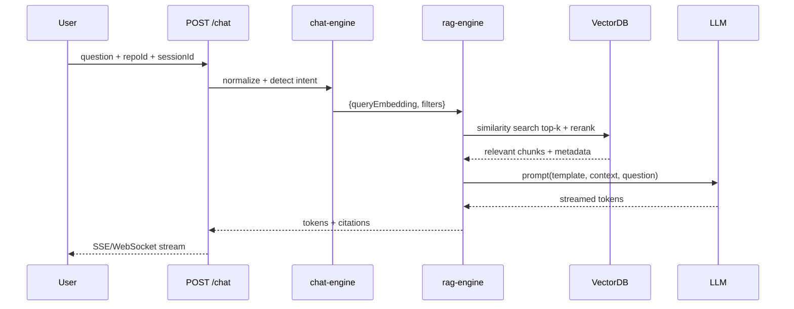

# AI Codebase Explainer – Architecture & Implementation Guide

## 1. Vision & Goals
- **Purpose**: Provide developers with an AI assistant that explains unfamiliar repositories via interactive chat grounded in the actual code.
- **Primary personas**: Platform engineers running due diligence on third-party repos, new team members onboarding to large monoliths, and consultants auditing open-source projects.
- **Key capabilities**: One-click GitHub ingestion, smart code chunking with AST awareness, vector search over embeddings, RAG-driven chat, and architectural visualization.
- **Non-goals**: Static doc generation or autonomous code modification.
- **Guardrails**: Deterministic re-indexing, traceable citations back to files/lines, and privacy-respecting temp storage.

## 2. Technology Stack Choices
- **Monorepo tooling**: Turborepo + pnpm workspaces for incremental builds and shared cache across packages.
- **Frontend**: Next.js (App Router), React Server Components, Tailwind CSS for design velocity.
- **Backend runtime**: Node.js 20 with Fastify (lower overhead vs Express) for API apps and background workers.
- **AI providers**: Pluggable driver defaulting to OpenAI GPT-4.1/GPT-4o; Gemini and Claude supported via configuration.
- **Embeddings**: OpenAI `text-embedding-3-large` (or local alternatives via `packages/embeddings`).
- **Vector database**: ChromaDB (embedded mode for local dev, service-backed for production) chosen for metadata-rich collections and simple sharding; FAISS optional behind a feature flag.
- **Infrastructure**: Docker images per app, orchestrated via ECS/Kubernetes; object storage (S3/GCS) for repo archives; Redis for caching; PostgreSQL for metadata persistence.

## 3. High-Level Architecture
```mermaid
flowchart LR
    subgraph User
        U[Web Client]
    end
    subgraph Frontend (Next.js)
        UI[Repo Input & Chat UI]
    end
    subgraph Backend
        API[apps/api Fastify server]
        Worker[Queue Workers]
        RAG[packages/rag-engine]
        Analyzer[packages/architecture]
    end
    subgraph Data
        RepoFS[Ephemeral Repo Storage]
        VectorDB[(ChromaDB)]
        Cache[(Redis)]
        MetaDB[(PostgreSQL)]
    end

    U --> UI
    UI -->|REST/websocket| API
    API -->|enqueue jobs| Worker
    Worker --> RepoFS
    Worker --> Analyzer
    Worker --> RAG
    RAG --> VectorDB
    API -->|query| VectorDB
    API --> Cache
    API --> MetaDB
    UI <-->|stream| API
```

## 4. Monorepo Layout & Responsibilities
```
codebase-ai/
├── package.json            # pnpm + Turborepo root
├── turbo.json              # pipeline definitions
├── pnpm-workspace.yaml
├── apps/
│   ├── web/                # Next.js App Router UI
│   └── api/                # Fastify API + webhook server
├── packages/
│   ├── shared/             # Types, logging, config loaders
│   ├── repo-analyzer/      # Git clone, filtering, AST parsing
│   ├── chunker/            # Intelligent chunk generation
│   ├── embeddings/         # Provider-agnostic embedding client
│   ├── vector-store/       # Chroma/FAISS adapters
│   ├── rag-engine/         # Retrieval orchestration + prompting
│   ├── architecture/       # Dependency graph + Mermaid output
│   └── chat-engine/        # Session mgmt, streaming, grounding refs
├── infrastructure/
│   ├── docker/             # Dockerfiles, compose for dev
│   └── deployment/         # IaC templates: Terraform/CloudFormation
├── docs/                   # Architecture & runbooks
└── scripts/                # Ops helpers (warm caches, cleanup)
```
- **apps/web** consumes internal packages via shared UI hooks and typed SDKs.
- **apps/api** exposes REST/WebSocket endpoints and orchestrates background jobs via BullMQ/Redis.
- **packages/** modules communicate through explicit TypeScript interfaces to keep boundaries clean.

## 5. Repository Ingestion System
### 5.1 Flow Overview

### 5.2 Key Responsibilities
- **Cloning**: use `isomorphic-git` for untrusted URLs or shell `git` inside sandbox. Support shallow clones (`--depth=1`) and sparse checkouts for large repos.
- **Authentication**: optional GitHub token stored transiently; use GitHub App for enterprise mode.
- **File scanning**: respect `.gitignore` + internal allowlist (code, configs) + blocklist (dist, node_modules, assets). Implement streaming directory walker capped by configurable max size.
- **Cleaning**: remove large binaries, normalize line endings, ensure consistent path separators.
- **Manifest**: produce JSON summary (file path, size, language, hash) stored in PostgreSQL for later diffing.

## 6. Smart Code Chunking
- **Goal**: produce semantically coherent chunks anchored to functions/classes to maximize retrieval relevance.
- **Parsing strategy**:
  - Detect language via `linguist` heuristics.
  - Use language-specific parsers (TypeScript compiler API, tree-sitter, ast-grep) to walk ASTs and extract declarations.
  - Fallback to heuristic chunker (sliding window with overlap) for unsupported languages.
- **Chunk formation**:
  - Each chunk retains: file path, symbol name, start/end lines, surrounding comments, imports/exports metadata, git commit hash.
  - Size heuristic: target 400-800 tokens (roughly 1.5-3 KB). If AST node exceeds limit, recursively split by logical child nodes or comment boundaries.
  - Maintain adjacency edges so RAG can traverse related chunks.
- **Metadata**:
  - `repo_id`, `file_path`, `symbol`, `language`, `dependencies`, `tests`, `last_indexed_at`.
  - Hash of file contents to detect drift and skip re-embedding unchanged chunks.

## 7. Embedding Pipeline
- **Embeddings**: numerical vectors capturing semantic meaning, enabling cosine similarity search against user queries.
- **Why**: lexical search fails across refactors; embeddings enable "What does the payment service do?" style questions.
- **Flow**:
  1. Chunk payload enters `packages/embeddings` queue.
  2. Provider adapter batches up to N tokens (respecting provider limit) and sends `texts[]` to embedding API.
  3. Responses stored with chunk metadata + model version.
  4. Observability: log latency, token usage, retries; flag drifts when model changes.
- **Batching**:
  - Group by language and token length to minimize padding waste.
  - Backpressure using BullMQ rate limits.
  - Persist pending batches to Redis so crashes do not lose work.
- **Fallbacks**: support local sentence-transformers for air-gapped deployments.

## 8. Vector Database Layer
- **ChromaDB** chosen for:
  - Native metadata filters (language, directory, test/code), enabling targeted retrieval.
  - Embeddable Python/TypeScript clients with persistence to disk/object storage.
  - Community support and easy switch to managed alternatives.
- **Data model**:
  - Collection per repo branch (e.g., `repoSlug@main`).
  - Document id = `${filePath}:${symbolHash}`.
  - Metadata includes chunk JSON, size, checksum, module classification.
- **Similarity search**: cosine similarity over normalized vectors; optional hybrid search that boosts lexical matches via BM25 overlay.
- **Operational notes**:
  - Warm caches of frequently queried repos in RAM.
  - Periodic compaction jobs.
  - Snapshotting to object storage for disaster recovery.

## 9. Retrieval Augmented Generation (RAG) Pipeline
### 9.1 Flow

### 9.2 Prompt Strategy
- **Sections**: (a) System persona, (b) Repo summary (auto-generated), (c) Retrieved context with `[path#Lx-Ly]` tags, (d) User question, (e) Response instructions (cite files, note uncertainty).
- **Context window**: dynamic budgeting ensures context fits 16k tokens. Use `TokenAllocator` to shrink chunk text (prioritize highest scores, compress via bullet summaries if needed).
- **Follow-ups**: Chat engine maintains short-term memory (prior user questions + chosen chunks) to bias subsequent retrieval.

## 10. Architecture Analyzer Package
- **Dependency extraction**:
  - Parse import/export graphs using language-specific analyzers (TypeScript AST, Python `ast` module, Go `go list`).
  - Build directed graph with nodes = files/modules, edges = dependencies.
- **Classification heuristics**:
  - Score modules as `controller`, `service`, `repository`, etc., using keyword matching + layer detection (e.g., files under `routes/` referencing HTTP libs).
  - Identify database access by scanning for ORM clients.
- **Outputs**:
  - JSON describing modules, centrality metrics, coupling scores.
  - Mermaid diagrams (flowchart + class diagrams) generated via templates and rendered in frontend.
  - Narrative summary (auto-generated) integrated into chat context.

## 11. Chat Engine Package
- **Responsibilities**:
  - Manage chat sessions (Redis + PostgreSQL) storing user turns, retrieved chunk ids, and streaming state.
  - Provide SSE/WebSocket interface for incremental tokens.
  - Align responses with references: map chunk metadata to `filePath#Lx-Ly` and include in message payload for frontend highlighting.
  - Guardrails: profanity filter, repo boundary enforcement, rate limits.

## 12. Frontend (apps/web)
- **Pages**:
  - `/` Repo onboarding: URL input, auth token field, ingestion status timeline.
  - `/repo/[slug]` Dashboard with tabs: Chat, File Explorer, Architecture.
- **Components**:
  - **Chat panel**: streaming responses via React Server Actions + client-side SSE hook; message bubbles show citations.
  - **File explorer**: virtualized tree viewer hitting `GET /repo/structure`.
  - **Architecture viewer**: Mermaid diagram renderer with zoom/pan + textual insights.
- **State management**: React Query for data fetches, Zustand for ephemeral UI state, server components for initial data.
- **Streaming UX**: use `fetch` with `ReadableStream` to pipe SSE tokens into UI; highlight code references as they arrive.
- **Design language**: Tailwind with custom theme tokens, responsive layout, dark/light modes.

## 13. Backend API (apps/api)
### 13.1 Endpoints
| Method | Endpoint | Description |
|--------|----------|-------------|
| POST | `/repo/load` | Validate URL, enqueue clone/index job, return job id. |
| GET | `/repo/status/:id` | Poll job progress (queued, cloning, chunking, embedding, complete). |
| POST | `/repo/index` | Force re-index (e.g., new commit) using manifest diff. |
| GET | `/repo/structure` | Return directory tree + stats for UI explorer. |
| GET | `/architecture` | Fetch analyzer outputs + Mermaid definitions. |
| POST | `/chat` | Start/continue chat session; streams RAG-backed responses. |
| POST | `/chat/session/:id/feedback` | Capture thumbs-up/down for quality logging. |

### 13.2 Internals
- Fastify routes call services in `packages/*` via dependency injection.
- Long-running tasks executed by worker processes (BullMQ) to avoid blocking API threads.
- Shared `RequestContext` ensures consistent logging and tracing (OpenTelemetry).

## 14. Caching & Index Persistence
- **Metadata DB (PostgreSQL)**: tables for repos, manifests, chunks, embedding jobs, chat sessions.
- **Redis**: job queues, hot chunk cache, session tokens.
- **Blob storage**: tarball snapshots, analyzer reports, Mermaid exports.
- **Strategies**:
  - Checksum-based deduping avoids re-embedding unchanged chunks.
  - Warm-start by loading latest embeddings into Chroma; fallback to disk snapshots.
  - Cache retrieval results per question signature to speed repeated queries.

## 15. Infrastructure & Deployment
- **Docker**: multi-stage builds; `apps/web` static export served via Vercel/CloudFront; `apps/api` container for ECS/Kubernetes; background workers extracted as separate services.
- **Vector DB**: deploy managed Chroma cluster or self-hosted container with persistent volume.
- **Secrets**: stored in AWS Secrets Manager/GCP Secret Manager; injected at runtime via environment variables.
- **CI/CD**: GitHub Actions pipeline running lint/test, build, dockerize, deploy via Terraform.
- **Scalability**: autoscale API and workers based on queue depth; pre-fetch embeddings using event-driven triggers when new commits detected.

## 16. Recommended Development Order
1. **Scaffold monorepo**: Turborepo, pnpm workspaces, shared config, lint/test pipelines.
2. **packages/shared**: logging, config, error types.
3. **repo ingestion + manifest**: clone, filtering, metadata storage; expose `/repo/load`.
4. **chunker + embeddings + vector-store**: produce embeddings end-to-end with test repo.
5. **rag-engine + chat-engine**: minimal RAG pipeline returning citations.
6. **frontend chat UI**: integrate streaming responses + citations.
7. **architecture analyzer + diagrams**: run on sample repos, surface via `/architecture`.
8. **file explorer + structure endpoint**.
9. **Caching/persistence enhancements**: checksum diffing, warm caches.
10. **Production hardening**: auth, rate limits, observability, CI/CD.

## 17. Verification Checklist
- ✅ Repository ingestion handles auth, filtering, manifesting.
- ✅ Chunking respects logical boundaries with metadata.
- ✅ Embeddings + vector store pipeline documented with batching.
- ✅ RAG flow, prompt strategy, and context budgeting detailed.
- ✅ Architecture analyzer outputs + diagrams described.
- ✅ Chat engine lifecycle and citation strategy defined.
- ✅ Frontend UX, backend endpoints, caching, and deployment covered.
- ✅ Development order provided for step-by-step implementation.
